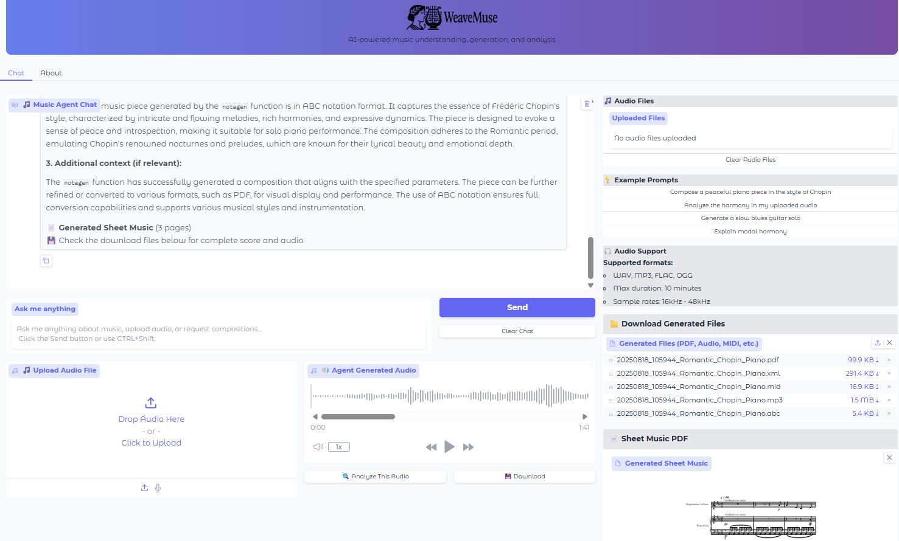

<div align="center">
   
</div>


# WeaveMuse

A comprehensive music agent framework built on smolagents, integrating state-of-the-art music AI models for understanding, generation, and interaction.

## Features

### 🎼 Music Understanding
- **ChatMusician Integration**: Natural language music analysis and understanding
- **Music Theory Analysis**: Automatic analysis of musical structures, harmony, and form
- **Audio Understanding**: Content analysis of audio files

### 🎵 Music Generation
- **Symbolic Music Generation**: ABC notation generation using NotaGen
- **Audio Generation**: High-quality audio synthesis using Stable Audio Open
- **Conditional Generation**: Generate music based on text prompts, styles, and constraints

### 🤖 Agent Framework
- **smolagents Integration**: Intelligent agent system that decides which tools to use
- **Multi-modal Support**: Text, audio, and symbolic music inputs
- **Tool Orchestration**: Seamless integration between different music AI models

### 🎨 Visualization & Interface
- **Gradio Web Interface**: User-friendly web interface for interaction
- **Score Visualization Integration**: Beautiful sheet music rendering in PNG, PDF, and MusicXML.
- **Audio Playback**: Integrated audio player for generated content

### 🐳 Deployment
- **Flexible Local Ready**: Scalable deployment options based on system capacity.
- **Remote Deployment**: Partially remote deployment through HF Inference Clients.

## Interface Preview

WeaveMuse provides an intuitive web interface for seamless music AI interaction:

<div align="center">
   
   <p><em>WeaveMuse's clean and intuitive web interface for music generation and analysis</em></p>
</div>

## Quick Start

### Prerequisites

This project is GPU-optimized and requires:
- Python 3.10 or later
- NVIDIA GPU with CUDA 12.1+ (recommended)
- At least 8GB VRAM for local models (recommended > 40GB)

### Installation with uv (Recommended)

[uv](https://astral.sh/uv/) is a fast, modern Python package manager that provides reliable dependency resolution and faster installs.

#### 1. Install uv

```bash
# Install uv (once)
curl -LsSf https://astral.sh/uv/install.sh | sh
# Or on Windows: powershell -c "irm https://astral.sh/uv/install.ps1 | iex"
```

#### 2. Clone and Install Project

```bash
# Clone the repository
git clone https://github.com/manoskary/weavemuse.git
cd weavemuse

# Install with GPU support (CUDA 12.1)
uv sync --extra-index-url https://download.pytorch.org/whl/cu121

# For development with all extras:
uv sync --extra dev --extra gpu --extra remote --extra audio --extra music --extra-index-url https://download.pytorch.org/whl/cu121

# Lock dependencies for reproducible installs
uv lock
```

#### 3. Activate Environment and Run

```bash
# Activate the uv environment
source .venv/bin/activate

# Run WeaveMuse
weavemuse serve
```

### Alternative Installation Methods

#### Using pip

```bash
# Clone the repository
git clone https://github.com/manoskary/weavemuse.git
cd weavemuse

# Install with GPU support
pip install -e ".[gpu]" --extra-index-url https://download.pytorch.org/whl/cu121

# For development
pip install -e ".[dev,gpu,remote,audio,music]" --extra-index-url https://download.pytorch.org/whl/cu121
```

#### Using conda

```bash
# Create conda environment
conda create -n weavemuse python=3.10
conda activate weavemuse

# Install PyTorch with CUDA
conda install pytorch torchvision torchaudio pytorch-cuda=12.1 -c pytorch -c nvidia

# Install WeaveMuse
pip install -e .
```

## Configuration

### HuggingFace Hub Setup

WeaveMuse uses models from HuggingFace Hub and supports remote inference. Set up your environment:

#### 1. Install HuggingFace CLI (included in dependencies)

```bash
# Already included, but if needed separately:
pip install huggingface_hub
```

#### 2. Login to HuggingFace Hub

```bash
# Login with your HuggingFace token
huggingface-cli login

# Or set environment variable
export HF_TOKEN="your_huggingface_token_here"
```

#### 3. Using Remote Inference (Optional)

For lightweight usage without local GPU requirements, you can use HuggingFace's Inference API. Please provide your HF token to use it.

#### 4. Create Environment File

```bash
# Copy example environment file
cp .env.example .env
```

Edit `.env` with your configuration (optional):

```env
# HuggingFace Configuration
HF_TOKEN=your_huggingface_token
HF_CACHE_DIR=./models/cache

# Model configurations
CHATMUSICIAN_MODEL_ID=m-a-p/ChatMusician
NOTAGEN_MODEL_PATH=./models/notagen
STABLE_AUDIO_MODEL_ID=stabilityai/stable-audio-open-1.0

# GPU configuration
DEVICE=cuda
TORCH_DTYPE=float16
CUDA_VISIBLE_DEVICES=0

# Server configuration
HOST=0.0.0.0
PORT=7860
DEBUG=false

# Remote API Keys (optional)
OPENAI_API_KEY=your_openai_key
ANTHROPIC_API_KEY=your_anthropic_key
```


### Verify Installation

After installation, verify everything is working:

```bash
# Check GPU availability
python -c "import torch; print(f'CUDA available: {torch.cuda.is_available()}')"

# Start the web interface
weavemuse gui
```

## Usage

### Command Line Interface

WeaveMuse provides flexible command-line options to launch different interfaces:

```bash
# Launch web interface (default)
weavemuse gui

# Launch terminal interface
weavemuse terminal

# For backwards compatibility, this also works:
weavemuse

# Show version
weavemuse --version
```

### Interface Options

#### 1. **Web Interface (GUI)** - `weavemuse gui`
- User-friendly Gradio web interface
- File upload capabilities for audio analysis
- Interactive chat with music agents
- Visual display of generated scores and audio playback
- Accessible (usually) at `http://localhost:7860`

#### 2. **Terminal Interface** - `weavemuse terminal`  
- Command-line interaction for advanced users
- Fast startup with on-demand loading
- Direct text-based communication with agents

### Model Configuration

When launching WeaveMuse, you'll be prompted to choose your model configuration:

```
🤖 Choose your AI model:
1. Only Local Models (Requires more resources and loading time)
2. HuggingFace cloud-based agent (some local tools - faster startup)  
3. All Remote (All models and Tools are remote - no resources needed)
```

**Important:** The backbone language model drives the intelligence of all WeaveMuse agents. When using smaller models due to computational constraints, expect the overall intelligence and reasoning capabilities of the system to be affected accordingly.

### System Architecture

WeaveMuse operates as a **multi-agent system** with specialized agents for different music tasks:

#### 🎯 **Manager Agent** (Main Controller)
- **Purpose**: Orchestrates all music-related tasks
- **Capabilities**: Task routing, file handling, workflow management
- **Tools**: Base smolagents tools + specialized music agents
- **Think-act-repair**: The Manager agent follows Think-act-repair protocol.
- **Intelligence**: Driven by the backbone model (local or remote)

#### 🎼 **Specialized Music Agents**

**1. Symbolic Music Agent**
- **Tools**: NotaGenTool
- **Function**: Generates symbolic music in ABC notation
- **Output**: PDF scores, MusicXML, MIDI files, MP3 audio
- **Use Cases**: Composition based on musical periods, composers, instrumentation

**2. Audio Analysis Agent**  
- **Tools**: AudioFlamingoTool, AudioAnalysisTool (optional)
- **Function**: Advanced audio content analysis using NVIDIA Audio Flamingo
- **Capabilities**: Musical element identification, acoustic analysis, content description
- **Input**: Audio files (any format supported)

**3. Audio Generation Agent**
- **Tools**: StableAudioTool  
- **Function**: High-quality audio synthesis from text descriptions
- **Technology**: Stable Audio Open model
- **Output**: 44.1kHz stereo audio files

**4. Web Search Agent**
- **Tools**: WebSearchTool
- **Function**: Music-related information retrieval
- **Capabilities**: Research, fact-checking, music knowledge expansion

#### 🛠 **Individual Tools Available**

WeaveMuse local tools support Lazy loading and GPU offloading, to prevent overheads and long waiting times when tools are not used.

**ChatMusicianTool**
- Natural language music analysis and understanding
- Music theory explanations and composition guidance
- Chord progression analysis and recommendations

**NotaGenTool** 
- Symbolic music generation in ABC notation format
- Supports various musical styles and instrumentation
- Automatic conversion to multiple formats (PDF, MIDI, MusicXML, MP3)

**StableAudioTool**
- Text-to-audio generation using Stable Audio Open
- Good-quality stereo audio synthesis
- Conditional generation based on prompts

**AudioFlamingoTool**
- Remote audio analysis via NVIDIA's Audio Flamingo model
- Advanced acoustic analysis and content understanding
- Zero-setup remote processing

**AudioAnalysisTool** (Optional)
- Local audio analysis using Qwen2-Audio model
- Requires local GPU resources
- Detailed musical content analysis

### Performance and Intelligence Considerations

#### 🧠 **Model Intelligence Impact**

The **backbone language model** is the core intelligence driving all WeaveMuse agents. This model determines:

- **Task Understanding**: How well the system interprets your requests
- **Tool Selection**: Which specialized tools to use for specific tasks  
- **Workflow Orchestration**: How effectively multiple tools are combined
- **Response Quality**: The coherence and helpfulness of outputs

**⚠️ Important**: When using smaller models due to computational constraints (low VRAM, CPU-only mode), expect reduced intelligence across all agents:

- **Local Models**: Better reasoning but require more resources (8GB+ VRAM recommended)
- **Remote Models**: Good balance of intelligence and resource usage
- **Smaller Models**: Limited reasoning but faster and lower resource requirements


### Example Usage Scenarios

#### Scenario 1: Compose and Analyze Music
```bash
weavemuse gui
# User: "Create a baroque-style piece for string quartet and analyze its harmonic structure"
# System: Uses NotaGenTool → ChatMusicianTool → Returns score + analysis
```

#### Scenario 2: Audio Analysis and Generation  
```bash
weavemuse terminal
# User uploads audio file: "What instruments are in this recording? Generate something similar."
# System: Uses AudioFlamingoTool → StableAudioTool → Returns analysis + new audio
```

#### Scenario 3: Music Research and Composition
```bash
weavemuse gui  
# User: "Research Beethoven's late string quartets and compose something inspired by Op. 131"
# System: Uses WebSearchTool → ChatMusicianTool → NotaGenTool → Returns research + composition
```

#### Troubleshooting

#### Common Issues

**CUDA/GPU Issues:**
```bash
# Check GPU availability
python -c "import torch; print(f'CUDA available: {torch.cuda.is_available()}')"

# Install CUDA packages if needed
uv sync --extra gpu --extra-index-url https://download.pytorch.org/whl/cu121
```

**HuggingFace Authentication:**
```bash
# Login with HuggingFace token
huggingface-cli login

# Or set environment variable
export HF_TOKEN="your_token_here"
```

**Dependency Conflicts:**
```bash
# Reset and reinstall
rm -rf .venv uv.lock
uv sync --extra-index-url https://download.pytorch.org/whl/cu121 --index-strategy unsafe-best-match
```

**Audio Generation Issues:**
```bash
# Install audio extras
uv sync --extra audio --extra-index-url https://download.pytorch.org/whl/cu121
```


## Integration and Extension

### Adding Custom Tools

WeaveMuse is designed to be extensible. To add custom music tools:

```python
from smolagents.tools import Tool
from weavemuse.tools.base_tools import ManagedTransformersTool

class CustomMusicTool(ManagedTransformersTool):
    name = "custom_music"
    description = "Your custom music tool description"
    inputs = {"prompt": {"type": "string", "description": "Input prompt"}}
    output_type = "string"
    
    def _load_model(self):
        # Implement your model loading logic
        pass
        
    def _call_model(self, model, **kwargs):
        # Implement your tool logic
        pass
```


## Models and Tools

### Integrated Models

1. **ChatMusician**: Music understanding and analysis
   - Model: `m-a-p/ChatMusician`
   - Capabilities: Music theory, harmony analysis, composition guidance

2. **NotaGen**: Symbolic music generation
   - Model: Custom implementation with pre-trained weights
   - Output: ABC notation format

3. **Stable Audio Open**: Audio generation
   - Model: `stabilityai/stable-audio-open-1.0`
   - Output: High-quality 44.1kHz stereo audio

4. **Audio Analysis**: Content understanding
   - Multiple models for different analysis tasks
   - Capabilities: Genre classification, mood detection, structure analysis

### Tool Capabilities

- **Music Composition**: Generate complete musical pieces
- **Harmony Analysis**: Analyze chord progressions and harmonic structure
- **Style Transfer**: Convert music between different styles
- **Audio Synthesis**: Convert symbolic music to audio
- **Format Conversion**: Between ABC, MIDI, MusicXML, and audio formats
- **Music Education**: Explain music theory concepts and analysis

## Contributing

We welcome contributions! Please see our [Contributing Guide](CONTRIBUTING.md) for details.

## License

This project is licensed under the MIT License - see the [LICENSE](LICENSE) file for details.

## Acknowledgments

- [smolagents](https://github.com/huggingface/smolagents) - Agent framework
- [ChatMusician](https://github.com/hf-lin/ChatMusician) - Music understanding symbolic 
- [NotaGen](https://github.com/ElectricAlexis/NotaGen) - Symbolic music generation
- [Stable Audio](https://github.com/Stability-AI/stable-audio-tools) - Audio generation
- [Audio Flamingo](https://audioflamingo.github.io/) - Music Understanding on Audio by NVIDIA
- [Qwen-Audio](https://qwen-audio.github.io/Qwen-Audio/) - Music Understanding on Audio by QWEN

## Citation

If you use this framework in your research, please cite:

```bibtex
@article{music_agent_framework,
  title={WeaveMuse: An Open Agentic System for Multimodal Music Understanding and Generation},
  author={Karystinaios, Emmanouil},
  year={2025},
  article={1st Workshop on Large Language Models for Music and Audio (LLM4MA)}
}
```

## TODO

### Upcoming Features and Improvements

- [ ] **Integrate Spotify MCP for song playback and id** - Add Spotify Model Context Protocol integration for enhanced music discovery, playback capabilities, and song identification features
- [ ] **Dreambooth stable-audio-open on music for better outputs** - Fine-tune Stable Audio Open with DreamBooth on music datasets to improve generation quality and musical coherence
- [ ] **Improve control on NotaGen** - Enhance NotaGen tool with better parameter control, style conditioning, and compositional constraints for more precise music generation
- [ ] **Integrate Neural Codec fun tool** - Add neural audio codec tools for advanced audio compression, reconstruction, and manipulation capabilities
- [ ] **Integrate Engraving Model** - Add EngravingGNN as a pipeline after NotaGen ouput to improve the layout of the generated MusicXML and PDF scores.
- [ ] **Integrate more tools and MCPs** - Expand the toolkit with additional Model Context Protocols and specialized music AI tools for broader functionality

### Roadmap

These improvements aim to enhance WeaveMuse's capabilities in music discovery, generation quality, user control, and ecosystem integration. Contributions and suggestions for these features are welcome!
